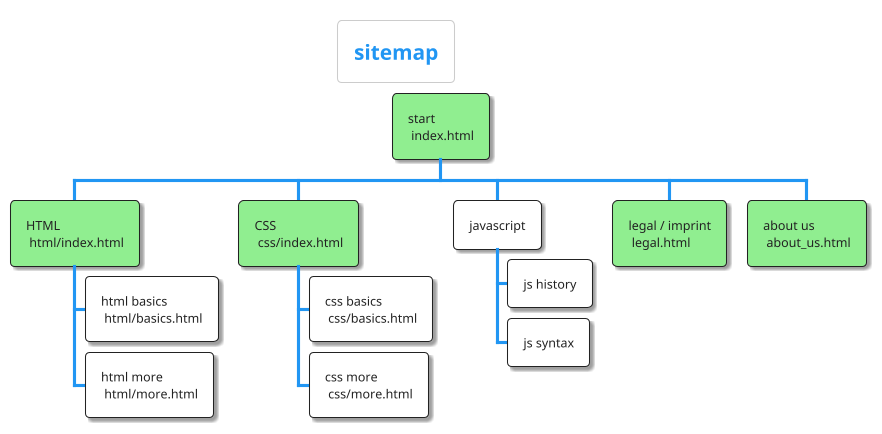

# what do we want to achieve

we want to create a webpage that helps other people to understand HTML,
CSS and JS the way we learned it.

## structure

these are the pages we want to create. all pages with green background
are the first ones to be created.

we create them by **copying** the `_template.html` file e.g. to
`about_us.html`.

# design

the design should be part of the `_template.html`.

so there should be a `header`, a `footer` and a `main`. the main navigation should be in a `nav` tag.
